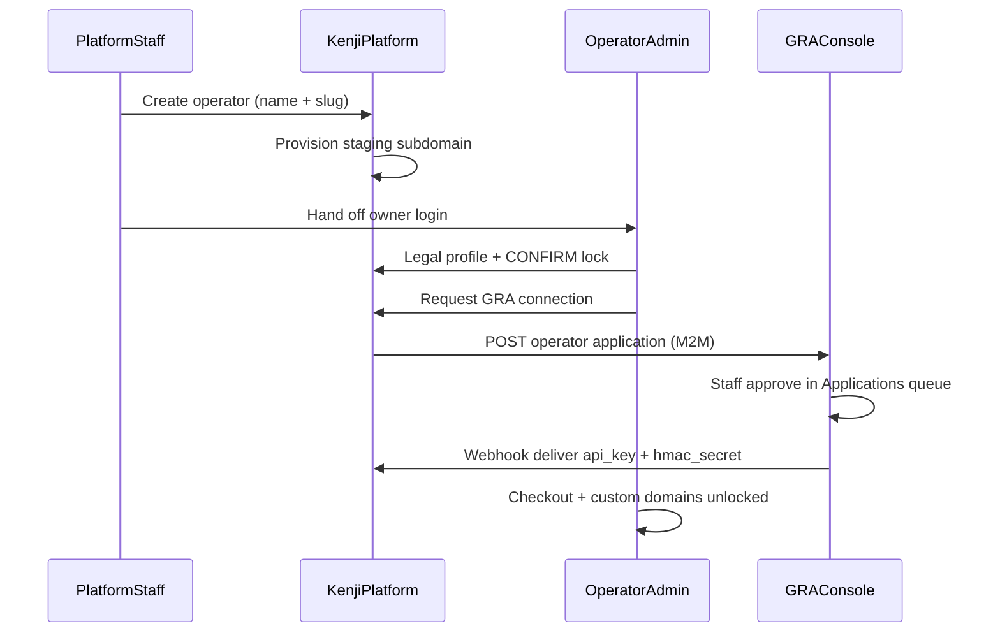

# Operator onboarding — who does what

Onboarding flow for Kenji Raffle Platform (production: **force42.com**).

## Kenji-first flow (GRA-linked)

Platform staff create the tenant first. The operator completes legal profile in admin, submits a GRA application, and GRA staff approve in the console. Keys are delivered to Kenji automatically — no manual “register in GRA first” step.



**During GRA review:** staging site and admin work (branding, raffles, preview) continue. Banner: account under GRA review. **Blocked:** live checkout, GRA event relay, custom-domain go-live UI.

**After approval:** credentials stored automatically; checkout and relay enabled; Domains go-live unlocked.

---

## Platform team (you)

**Where:** https://platform.force42.com

1. **Create operator** — Platform → Operators → New (name, slug). GRA registry ID defaults to `op-{slug}`.
2. **Wait for provisioning** — worker running; operator status **active**, tenant DB **active** (`scripts/wait-for-provision.py --slug {slug}`).
3. **Hand off to customer** — send copy block from operator detail page:
   - Staging: `https://{slug}.force42.com`
   - Admin: `https://{slug}.force42.com/admin`
   - Login: `owner@{slug}.local` / `ChangeMe123!` (change after first login)
   - **Next:** Admin → **GRA onboarding** — legal profile, CONFIRM, request GRA connection
4. **Monitor** — operator detail shows `gra_application_status` timeline.
5. **Emergency only** — manual GRA key override on platform operator detail (admin).
6. **Support when needed** — suspend, reprovision, audit drill-down.

See [IMPORTANT.md](../IMPORTANT.md) for GRA event mapping and payment-gateway vs ingest split.

You do **not** configure the operator’s custom domain DNS — they do that in their admin after GRA approval.

### Automation

```bash
scripts/test-gra-onboarding-e2e.sh
scripts/gap-scan-first-operator.sh
```

---

## GRA staff

**Where:** https://console.force42.com → **Applications**

1. Open pending application from Kenji platform.
2. Review legal entity fields (legal name, KRA PIN, beneficial owner, etc.).
3. **Approve** — creates GRA operator + primary site + ingest credentials; delivers keys to Kenji.
4. **Reject** — reason sent to Kenji; operator sees rejection on onboarding page.

Manual approval is required (regulatory).

---

## Customer (licensed operator)

**Where:** Their admin on staging → `/admin`

1. **Log in** — change password on first login.
2. **GRA onboarding** — Admin → GRA onboarding:
   - Enter legal profile → save draft → review modal → type **CONFIRM** to lock
   - Click **Request GRA connection**
   - Wait for GRA approval (banner shown during review)
3. **Customise during review** — Settings (logo, colours), Raffles, Categories, preview staging site.
4. **After approval** — Admin → Domains:
   - Enter `www.theirbrand.co.ke`
   - Copy DNS records (CNAME → `customers.force42.com`)
5. **At their Cloudflare** — add CNAME, SSL/TLS, verify DNS in admin, set primary domain.
6. **Live checkout** — enabled automatically after GRA delivers credentials.

---

## DNS summary

| Record | Where customer sets it | Value |
|--------|------------------------|--------|
| CNAME | Operator’s Cloudflare (or registrar) | `www` → `customers.force42.com` |
| TXT (optional) | Same | shown on Domains page |

Available **after GRA approval** only.

---

## Integration environment (both repos)

Shared secret and URLs must match on Kenji API and GRA staff API:

```
PLATFORM_GRA_INTEGRATION_SECRET=<shared-hmac-secret>
GRA_INTEGRATIONS_URL=https://console.force42.com/api/integrations/v1
KENJI_PLATFORM_CALLBACK_URL=https://api.force42.com/v1/platform/integrations/gra/credentials
```

Kenji `.env` — see `.env.example`. GRA `.env` — `PLATFORM_GRA_INTEGRATION_SECRET` only (callbacks use URL from application payload).

---

## CORS (custom domain go-live)

When a custom domain is verified, add it to VPS raffle API env if not covered by wildcard:

```
CORS_ALLOWED_ORIGINS=https://demo.force42.com,https://*.force42.com,https://www.theirbrand.co.ke
```

---

## Environment (production VPS)

```
NEXT_PUBLIC_TENANT_BASE_DOMAIN=force42.com
CUSTOM_DOMAIN_CNAME_TARGET=customers.force42.com
GRA_INGEST_URL=https://ingest.force42.com/v1
GRA_INTEGRATIONS_URL=https://console.force42.com/api/integrations/v1
PLATFORM_GRA_INTEGRATION_SECRET=<shared>
KENJI_PLATFORM_CALLBACK_URL=https://api.force42.com/v1/platform/integrations/gra/credentials
HARAMBE_PAYMENT_MODE=live
HARAMBE_GATEWAY_URL=https://pay.force42.com/v1/pay
HARAMBE_CALLBACK_SECRET=<shared-with-kenji-gateway>
GATEWAY_DEV_MOCK=false
```

**Gateway GRA keys:** `/var/www/kenji-gateway/.env` holds one key pair today. Demo (`op-001`) works out of the box. Per-operator gateway credentials are deferred.

---

## Related

- [DEMO_RUNBOOK.md](./DEMO_RUNBOOK.md) — demo tenant (`demo.force42.com`, pre-approved GRA status)
- [VPS_DEPLOYMENT.md](./VPS_DEPLOYMENT.md) — deploy paths
- [kenji-government/vps-domain-structure.txt](../../kenji-government/vps-domain-structure.txt) — hostname map
